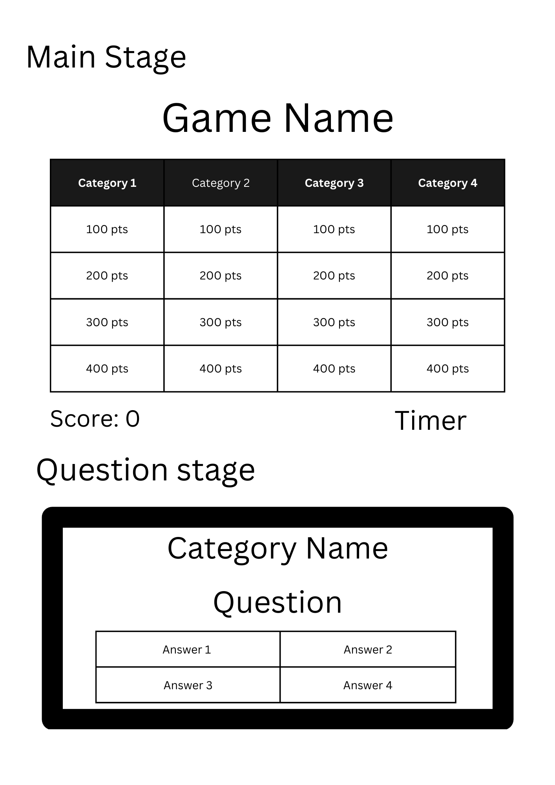

# ArmagHEADon!

## Game Description

ArmagHEADon is a Jeopardy! style quiz game, themed after Dan Harmon's <i>Rick and Morty</i> Season 2 Episode 5, <b> "Get Schwifty." </b>

## Screen Shots of Game Play

## Breakdown of Technologies Used

- ## Languages Used:
  - JavaScript - <i>Game Mechanics</i>
  - CSS - <i>Page Styling</i>
  - HTML - <i>Page Structuring</i>

## Installation Instructions

If downloading from GitHub:

1. Click the <b>green</b> code button

2. Select 'Download Zip' from the drop down.

3. Extract file once download is complete

4. Open main file folder, right click 'start.html' and open with your preferred browser!

Out of space? Click the link below for the web based version!

## User Stories

AAU I want to click start in a start menu
AAU I want to see a rules page
AAU I want to choose my own category
AAU I want to see my score update in real time
AAU I want to be able to exit at any time

## MVP Goals

✅ - Start Menu

✅ - User clicks category

✅ - Question will be self scoring

✅ - Score will update upon correct answers

✅ - Final scores page / game over

✅ - Countdown timer (On return to Main)

## Wireframe

